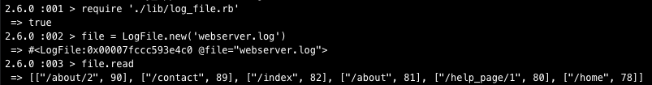
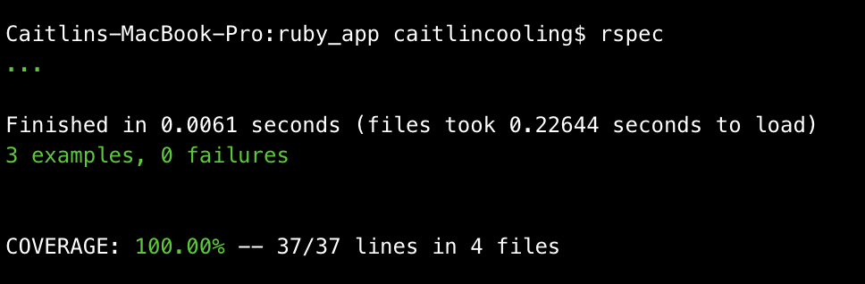

# Smart Pension Ruby Developer Test
This is a command line app that gives the user a list of webpages and the corresponding views, starting with the highest, and ending with the lowest when given a log file.

## Using this app
1. `git clone git@github.com:Caitlin-cooling/sp_ruby_app.git`
2. `cd sp_ruby_app`
3. `irb`
4. `require './lib/log_file.rb'`
5. Create a new log file. For example `file = LogFile.new('webserver.log')`
6. Call the read method on your new object `file.read`

## My Approach to this Problem
I took an OOP approach to this problem, having a LogFile class and a Counter module to separate concerns.

I decided to use TDD to ensure that my tests were meaningful, test coverage was high and code was clean.

## Testing
Tests are written using RSpec, please run them using the command `rspec` when in the project directory. All tests are currently passing and coverage is 100%.

## Dependancies
* Ruby version 2.6 was used as it is an up to date stable version.
* Simplecov has been used with RSpec to calculate test coverage.
* RuboCop has been used to lint the code, ensuring a high quality.
